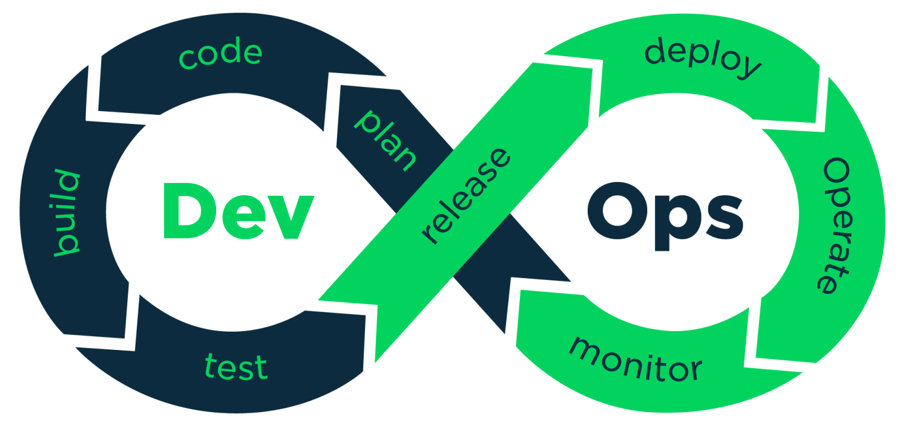

# DEVOPS란?
## Definition
<b> DevOps </b> 는 development와 operations 가 합쳐진 단어이다.
DevOps 의 정의는 개발환경과 운영을 통합하여 소프트웨어의 개발과 배포 속도를 빠르게 하면서 안정성과 품질을 높이기 위한 방법론이자 문화이다.  

  

## Importance of DevOps
<b>DevOps</b>는 중 ~ 대 규모 프로젝트에는 거의 필수적으로 사용되는 기술(문화)로 자리잡았다. 그 이유는 현대 서비스 시장의 상황을 보면 알 수 있다. 기업이 시장에서의 우위를 유지하려면 신속하면서도 수준 높은 제품을 만들고, 지속적으로 개선해주어야 다른 서비스보다 우위를 점할 수 있다. 하지만 기존에는 development(개발) 과 operations(운영)이 나뉘어져 있었기 때문에 배포하는데에 시간이 많이 걸렸다. 이는 기업의 서비스 경쟁력을 떨어트렸다.