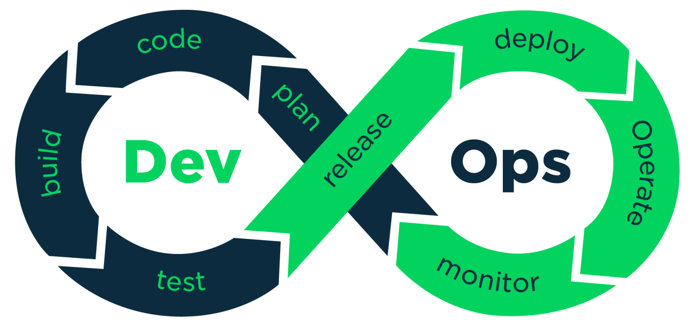
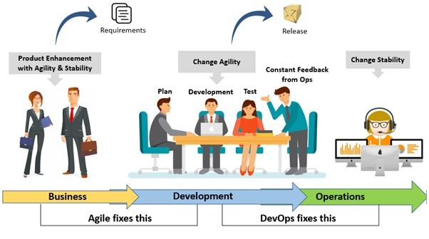

# DEVOPS?
이 페이지에서는 DevOps에 대해서 서술합니다.

## Definition
<b> DevOps </b> 는 development와 operations 가 합쳐진 단어이다.
DevOps 의 정의는 개발환경과 운영을 통합하여 소프트웨어의 개발과 배포 속도를 빠르게 하면서 안정성과 품질을 높이기 위한 방법론이자 문화이다.  

    

## Importance of DevOps
<b>DevOps</b>는 중 ~ 대 규모 프로젝트에는 거의 필수적으로 사용되는 기술(문화)로 자리잡았다. 그 이유는 현대 서비스 시장의 상황을 보면 알 수 있다. 기업이 시장에서의 우위를 유지하려면 신속하면서도 수준 높은 제품을 만들고, 지속적으로 개선해주어야 다른 서비스보다 우위를 점할 수 있다. 하지만 기존에는 development(개발) 과 operations(운영)이 나뉘어져 있었기 때문에 배포하는데에 시간이 많이 걸렸다. 이는 기업의 서비스 경쟁력을 떨어트렸다. 이러한 문제점을 해결하기 위한 기술(문화)가 DevOps 이다.

## DevOps Cultural Philosophy
DevOps의 문화적 철학은 소프트웨어 개발과 운영의 통합을 통해 신속한 배포, 지속적인 피드백, 그리고 책임을 공유하는 환경을 구축하는 데 중점을 둔다. 개발자와 운영자는 각기 다른 목표를 추구하는 것이 아니라, 공동의 목표를 향해 협력하여 더 나은 품질의 소프트웨어를 더 빠르게 배포할 수 있도록 한다. 이 철학은 자동화와 지속적 개선을 강조하며, 실수를 최소화하고 빠르게 복구할 수 있는 능력을 기르는 것을 목표로 한다. 또한 신뢰와 투명성을 기반으로 팀 간 소통을 강화하고, 피드백을 빠르게 반영해 지속적인 발전을 추구한다.

    

## Benefits of DevOps
<a href="https://www.atlassian.com/ko/whitepapers/devops-survey-2020">Atlassian의 2020년 DevOps 트렌드 설문 조사</a>에 의하면 응답자의 99%가 DevOps가 조직의 긍정적인 영향을 미쳤다고 답했다. 긍정적인 영향으로는

1. ``개발 및 배포 속도`` : DevOps를 활용하는 팀은 제품을 더 자주 릴리즈할 수 있고, 그로 인해 더 높은 수준의 서비스를 제공할 수 있다.

2. ``공동 작업`` : DevOps는 개발자들의 책임을 공유하고 작업을 합치는 개발팀과 영업팀 간의 <b>공동 작업 문화</b>이다. 이를 통해 원활한 공동 작업이 가능하다.

3. ``빠른 배포`` : DevOps 팀은 릴리즈의 빈도와 속도를 높여 서비스를 빠르게 개선할 수 있다. 이를 통해서 더 높은 품질의 서비스를 제공하고 사용자의 경험을 개선할 수 있다.

4. ``품질 및 신뢰성`` : 지속적 통합 및 지속적 배포 (CI/CD)와 같은 관행은 변경 사항이 기능적이고 안전하도록 보장한다. 이는 서비스의 품질을 향상시킨다. 또, 팀은 모니터링을 통해서 실시간으로 성과를 파악할 수 있다.

5. ``보안`` : DevSecOps 와 같은 지속적 통합 지속적 배포 파이프라인에 보안을 통합하여 개발 프로세스에 포함시켜 자동으로 보안 검토와 테스트가 이루어지고, 에자일 개발과 DevOps의 흐름 속에서 보안이 포함되게 한다. 이를 통해서 최종 서비스에서 보안이 기본적으로 갖추어지게 한다.

## DevOps Life Cycle
DevOps 의 생명주기는 7단계로 나뉜다.

1. ``지속적인 개발`` : 개발 단계에서는 기능을 구현하고 코드를 작성하는 과정이 반복적으로 이루어진다. 팀원들은 함께 협력하여 코드를 작성하고 버전 관리를 통해 코드의 변경 사항을 기록하여(GIT 을 이용하여) 효율적인 협업을 한다.

2. ``지속적인 통합`` : 개발자는 하루에도 여러 번 코드를 공유 저장소에 통합하며, 자동화된 빌드를 통해 문제를 조기에 감지한다. 이를 통해 더 작은 변화로 더 빠르게 높은 품질의 코드를 배포한다.

3. ``지속적인 테스트`` : CI와 함께 자동화된 테스트를 통해 배포 전 코드 품질을 보장한다. 수동 작업을 줄이고, 빠르게 버그를 발견하여 프로덕션에 영향을 주기 전에 해결한다.

4. ``지속적인 모니터링`` : 소프트웨어 성능을 실시간으로 모니터링하여 문제를 빠르게 감지하고 해결하며, 피드백 루프를 통해 사용자 경험을 개선한다.

5. ``지속적인 피드백`` : 코드 변경 사항을 자동으로 프로덕션 환경에 배포하여 배포 속도를 높이고 사용자 피드백 루프를 가속화한다. 이를 통해 대규모 업데이트에 따른 위험을 최소화한다.

6. ``지속적인 배포`` : 다운타임을 최소화하고 시스템 안정성을 유지하며, 사용자 피드백을 기반으로 개선 사항을 반영하여 DevOps 생명주기를 완성한다.

7. ``지속적인 운영`` : 지속적 운영은 시스템의 안정성과 성능을 최적화하여 서비스 중단이나 다운타임을 최소화하는 데 중점을 둔다. 사용자 피드백과 버그 보고서를 통해 지속적인 개선을 이끌어내며, DevOps 수명주기의 루프를 완성한다.