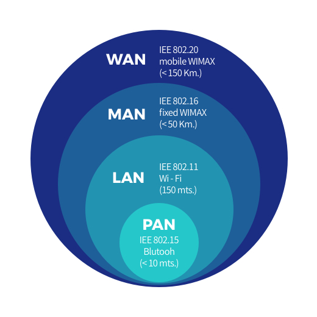

## Network란?

네트워크(Network)는 **Net(그물)**과 **Work(작업)**의 합성어로, 컴퓨터나 스마트폰, 프린터 등과 같은 노드들이 통신 기술을 통해 연결되어 데이터를 주고받는 구조를 의미한다. 네트워크를 통해 컴퓨터 간에 데이터를 교환하고 자원을 공유할 수 있으며, 이는 여러 장치들이 물리적 또는 논리적으로 연결되어 하나의 큰 그물망을 이루는 방식이다.

### 네트워크의 장점
- **리소스 공유**: 네트워크를 통해 컴퓨터와 사용자들은 각기 물리적, 논리적 자원을 서로 공유할 수 있다.
- **정보 교환**: 네트워크 상에서 데이터 통신을 통해 다양한 정보와 파일을 빠르게 주고받을 수 있다.

### 네트워크의 단점
- **보안 문제**: 네트워크를 통해 악성 코드나 바이러스에 노출될 수 있으며, 해킹을 통한 개인정보 유출 위험이 존재한다.
- **데이터 변조**: 네트워크를 통해 전송되는 데이터가 악의적으로 변조될 가능성도 있다.

## 데이터 통신이란?
데이터 통신은 **컴퓨터 간 데이터를 주고받는 과정**을 의미하며, 이를 위해서는 통신 기기와 프로토콜이 필요하다. 기기는 컴퓨터나 인터페이스, 통신 매체 등을 포함하며, **프로토콜**은 데이터 통신을 위한 규칙을 정한다.

## 네트워크의 분산 처리
네트워크는 여러 컴퓨터들이 연결되어 분산 처리 방식으로 작업을 나눌 수 있다. 이는 하나의 대형 시스템이 전체 작업을 처리하기보다는, 개별 노드가 각 작업을 분할 처리함으로써 효율성을 높이는 방식이다.

## 회선 교환과 패킷 교환
- **회선 교환**: 회선을 통해 1대 1로 연결되어 데이터를 전송하는 방식이다. 다수의 컴퓨터와 연결하려면 많은 회선이 필요하며, 회선이 점유되면 동시에 여러 장치가 통신할 수 없다.
- **패킷 교환**: 데이터를 여러 개의 작은 패킷으로 분할해 송신하는 방식이다. 각 패킷은 별도로 전송되므로 회선이 점유되지 않으며, 여러 기기가 동시에 사용 가능하다. 패킷은 전송 순서와 도착 순서가 다를 수 있다.

## 라우터
라우터는 **패킷 교환기** 역할을 하며, 수신처로 패킷을 전송하거나 회선이 사용 중일 때는 임시 저장해두는 역할을 한다. 라우터는 네트워크의 핵심 장치로, 복수의 패킷 교환기를 연결하여 **패킷 교환 네트워크**를 형성한다.

## 네트워크의 종류

    

- **PAN(Personal Area Network)**: 개인 영역 네트워크로, 가장 작은 규모의 네트워크.
- **LAN(Local Area Network)**: 근거리 영역 네트워크로, 같은 건물이나 가까운 거리 내에서 사용하는 네트워크.
- **MAN(Metropolitan Area Network)**: 대도시 영역 네트워크.
- **WAN(Wide Area Network)**: 광역 네트워크로, 여러 도시나 국가 간을 연결하는 네트워크.

## 회선 구성 방식
- **포인트 투 포인트(Point-to-Point)**: 중앙 컴퓨터와 단말기를 1대 1로 연결하여 데이터를 전송하는 방식.
- **멀티 드롭(Multi-Drop)**: 여러 단말기를 하나의 통신 회선에 연결하여 사용하는 방식으로, 멀티 포인트(Multi-Point)라고도 함.
- **회선 다중 방식**: 다중화 장치를 이용해 여러 단말기를 중앙 컴퓨터와 연결하여 사용하는 방식.
